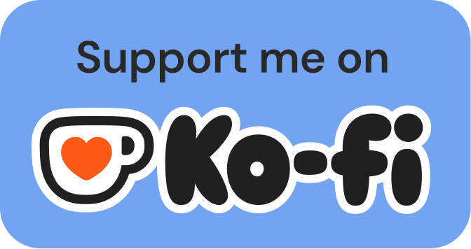

## Hey there 👋, I'm [Spartaco!](https://github.com/rez23/)

### Glad to see you here! 

I am a Full Stack Developer of many years of experience, with the firm conviction that the Open Sources will make the world better. 🚀

I'm an explorer of new tech, an avid learner, and I search to stay my skills up to date with the last technogiels standard and tools. When I'm not in code, I play music. I am a guitarist a singer and a DJ.

Feel free to connect with me @rez23 or via [email](spartaco.amadei@outlook.it) for all things tech or just to say hello!. 🌟

Joined Github **10** years ago.

<h3 align="left">✨ Random Dev Quote::</h3>

  

Like My Work?

### Talking about Personal Stuff:

- 🛠 &nbsp; I’m currently working with JS, TS, C and C++.
- 🚀 &nbsp; I’m currently exploring ML, Gen AI, LLMs, etc.
- 💬 &nbsp; Ask me anything [here](https://github.com/rez23/rez23/issues/2)! I am happy to help.
- 📫 &nbsp; Reach me out via [mail](spartaco.amadei@outlook.it).

### My Absolute Favorites:

- 💻 &nbsp; I love exploring new technologies and building cool stuff.
- 📰 &nbsp; Reading, writing & watching Tech Stuff whenever possible.
- 🍕 &nbsp; Meetups & Tech Events & Hackathons.

### Languages and Tools:
<code></code>
<code></code>
<code></code>
<code></code>
<code></code>
<code></code>
<code></code>
<code></code>
<code></code>

### Projects and Dev Stuffs:

  
<b>⚡ Github Stats</b>

   
  
  

  
<b>☄️ Github Streaks</b>

   
  

#

### Show some ❤️ by starring some of the repositories!

